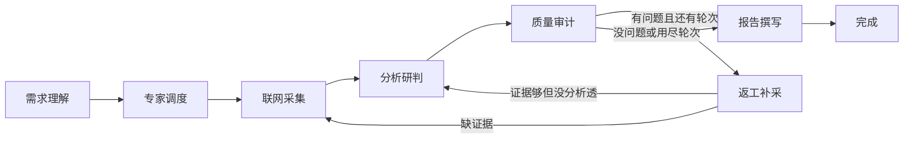
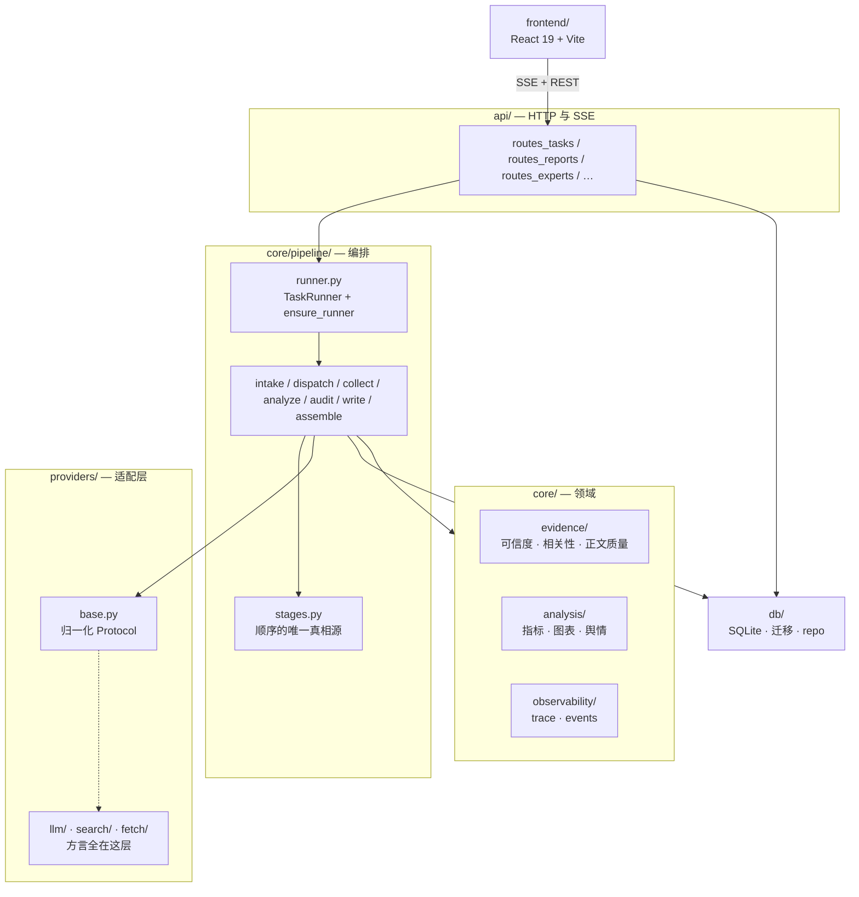
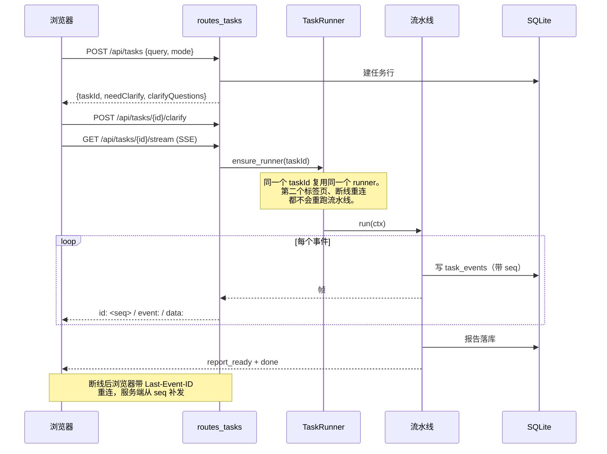

# 架构

> 这份文档里**流水线的顺序是被测试守着的**：下面那个 mermaid 块的节点顺序
> 必须逐字等于 `backend/app/core/pipeline/stages.py` 的 `STAGE_ORDER`。
> 改了代码没改文档，`tests/unit/test_docs_order.py` 会红。
> 这条约定本身写在 `stages.py` 的 docstring 里——三处引用同一个常量，
> 而文档是其中一处。

## 一、流水线

**质检在写作之前。** 这不是随手排的：写作是最贵的一步（章节逐节生成，
每节都要带上证据上下文）。质检排在写作之后，发现证据不足时的返工成本是
"重写全部章节"；排在之前，返工只是"补采几条 + 重跑一次分析"。
参考实现的**文档**把顺序写反了（写成"分析 → 撰写 → 质检"），
但它代码里的实际顺序是对的。这里沿用代码那个顺序，并用测试把文档钉住。

### 为什么顺序是一个常量而不是散落的字符串

`PIPELINE_STAGES` 一处定义，供给三方：

| 消费者 | 用途 |
|---|---|
| `GET /api/pipeline/stages` | 前端画 DAG、算进度 |
| SSE 首个 `node_update` | 工作台的进度轨 |
| `tests/unit/test_docs_order.py` | 钉住本文档的 mermaid 块 |

进度权重不是"阶段数均分"。采集 34 + 分析 30 占了三分之二：
均分会让进度条在最慢的两个阶段以数倍速爬行然后长时间卡住，
用户会以为它挂了。权重写在 `StageSpec.weight` 里，改它要连着理由一起改。

## 二、分层

### 依赖方向只有一条

`api → pipeline → providers | core → db`。反向依赖一处都没有：

- **pipeline 不认识任何厂商。** `collect.py` 里只出现
  `search(SearchQuery(text=..., sites=..., freshness="month"))`。
  它变成博查的 `include` + `oneMonth`、Tavily 的 `include_domains` + `days`，
  还是 Serper 的 `site:` + `tbs`，是适配器的私事（见 `docs/PROVIDERS.md`）。
- **providers 不认识流水线。** 适配器只做"把这家的话翻译成归一化语义"，
  不做重试策略之外的任何决策。

### 为什么要多一层 providers

参考实现把厂商方言漏进了编排层：`settings.zhipu_model_core`、
`freshness="oneYear"`、`include="douyin.com"`、以及一个业务错误码字典，
全都散在 `search.py` / `llm.py` 里。换一家搜索源要改流水线。

代价是**多一层间接**，而且适配层自己的测试要造假 HTTP 传输
（`httpx.MockTransport`）。换来的是"新增一家 = 写一个文件，流水线零改动"。

## 三、数据流

### 三件容易被做错的事

1. **重复订阅不该重跑流水线。** 参考实现在请求处理器里直接调
   `run_pipeline`，没有注册表——`EventSource` 自动重连、或开第二个标签页，
   就对同一个 `task_id` 再跑一遍，重复写证据、trace、专家统计。
   这里 `ensure_runner()` 按 taskId 复用。
2. **SSE 帧必须带 `id:`。** 不带就没有断线续传：跑到一半刷新页面，
   状态全丢。`task_events` 表按 seq 存事件，重连时从 `Last-Event-ID` 之后补发。
3. **seq 是按任务计的，不是全局计数器。** 参考实现用一个模块级 `_SEQ`，
   两个并发任务的 seq 交错，而决策回放的滑杆恰恰依赖 seq 排序。

## 四、四条铁律

这四条不是价值观展示，每一条都有可量化的指标和一个守着它的测试。

| 铁律 | 含义 | 指标 | 守在哪 |
|---|---|---|---|
| 1. 引用强制 | 每个论点必须挂证据 | 幻觉引用率、无证据立论率 | `core/evidence/citations.py`、coercer |
| 2. 交叉验证 | 关键结论要多个独立信源 | 交叉验证率、独立信源数 | `citations.MIN_INDEPENDENT_DOMAINS` |
| 3. 返工闭环 | 质检发现问题要真的能补 | 返工提升 Δ | `pipeline/orchestrator.py` 的 `_rework_loop` |
| 4. 不确定要说出来 | 证据不足就降级，不硬写 | 降级率、降级清单 | `ctx.degraded_blocks` |

**铁律 3 曾经在结构上不成立**：返工共用首轮的搜索预算，而首轮预算按
`planned[:budget]` 一次花到见底，所以返工拿到的永远是 0 次检索——
返工发生了，一条证据都补不到，Δ 恒为 0，而症状伪装成"补采没有新增证据"。
修法是拆出 `rework_search_calls` 独立池子。详见 `问题记录.md` 问题 23。

## 五、可观测

`core/observability/trace.py` 用 `contextvars` 埋点：业务代码不需要
把 tracer 当参数传来传去，`with span("collect.dimension", ...)` 就够了，
且天然对 `asyncio.to_thread` 扇出安全（每个线程有自己的 context 副本）。

- **span 树**：每次 LLM / 搜索 / 抓取调用一个 span，带 `purpose`、
  `evidence_ids`、token、成本、耗时。
- **决策回放**：span 的时间戳与 `task_events` 的 seq 对齐，
  拖动滑杆就能看到"这一刻模型看到了哪些证据"。
- **成本**：各家按自己的货币计价，在适配层按定价表折算成美元
  （汇率是定价表里一个**有日期的常量**，不是实时查的）。

## 六、已知取舍

写在别处的几处，索引一下：

| 取舍 | 代价 | 记在哪 |
|---|---|---|
| 整份报告 JSON 存 `reports.data` 一列 | 无法用 SQL 按报告内部字段筛选 | `技术栈.md` 负面清单 |
| 质检在写作之前 | 分析阶段的返工可能白跑（写作时才发现写不出来） | 本文第一节 |
| 单后端，不做 Vercel 镜像 | 部署少了免费额度这条路 | `docs/DECISIONS.md` |
| 迁移用 `PRAGMA user_version` + 有序列表 | 没有 Alembic 的自动生成与降级 | `docs/DECISIONS.md` |
| cassette 按请求内容做 key | 改一个字（prompt / query / temperature）就全部 miss | `docs/EVAL.md` |
